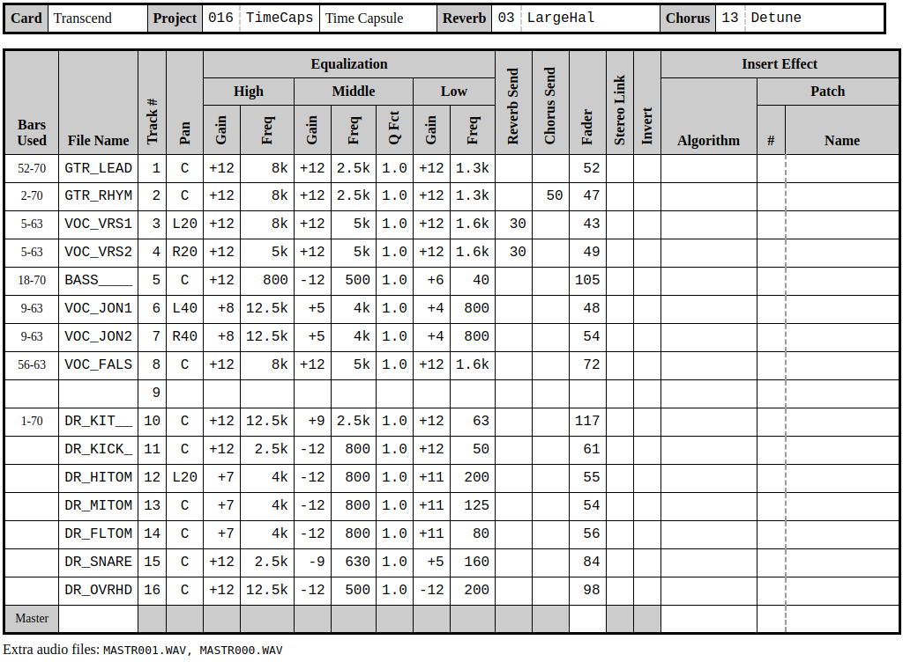

# Zoom Project Reader

This is a project attempts to produce a chart for a song recorded on Zoom's R-16 digital recorder. Have you ever used this recorder and wished that you could know what is on each track? What the EQ is? Fader? Effects? Well, now you can!

This project contains a set of Python scripts to decode the binary data stored in the two files: `PRJDATA.ZDT` and `EFXDATA.ZDT`. While there is no documentation binary file specifications, nor API provided by the company, I have attempted to decode these files and expose the salient settings for a given Zoom project.

Right now, the results can be used to produce an HTML file that looks like the following:



## Installation

To install the necessary packages, use:

```
$ python3 -m venv .
$ . ./bin/activate
$ pip3 install -r requirements.txt
```

You may want to set up a local environment first.

## Usage

To generate an HTML representation of a Zoom project, use the following syntax:

```
$ python3 src/zoom_project_reader/main.py PROJECT_DIR EXTRA_JSON HTML_FILE
```

where `PROJECT_DIR` is the directory that contains a Zoom R-16 project directory, `EXTRA_JSON` is a JSON file that contains additional information (that cannot be stored in a Zoom project) to enhance the chart and `HTML_FILE` is the name of an HTML that is generated by this script.

### Extra JSON File

Currently, a file needs to be supplied (even if it is non-existent) to contain this type of data. The information contained includes:

* The name of the SD card that contains this project. If you work with this device enough, you may find that you have several SD cards. This helps you locate the correct SD card for this project.

* The "full name" of this project (or song). Right now, you are limited to 8 characters to name your Zoom Project. This field provides you with a more legible name.

* Track information. I find it useful to know what bars a track has sound on. To store this type of information, you need to associate the track file name with a field called `bars_used`.

You can find some examples of these files in the `ExtraJson` folder.
